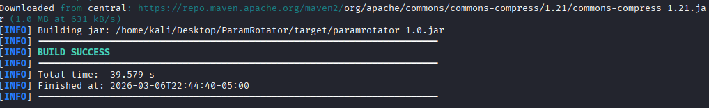

# ParamRotator

[](https://portswigger.net/burp)
[](https://www.oracle.com/java/technologies/javase/jdk17-archive-downloads.html)
[](https://maven.apache.org/)
[](LICENSE)
[]()

> A Burp Suite extension that automates dynamic HTTP parameter management, keeping requests valid throughout your entire security testing workflow.

---

## Overview

**ParamRotator** eliminates the overhead of manually managing rotating tokens, session identifiers, and other dynamic parameters during penetration testing.

By automatically extracting and refreshing these values, the extension ensures that requests remain valid throughout the testing workflow — allowing security testers to focus on vulnerability discovery rather than request maintenance.

---

## Table of Contents

- [The Problem](#the-problem)
- [The Solution](#the-solution)
- [Features](#features)
- [Requirements](#requirements)
- [Installation](#installation)
- [Demo](#demo)
- [Contributing](#contributing)
- [License](#license)

---

## The Problem

Modern web applications rely heavily on **dynamic parameters** that rotate frequently during a user session — session identifiers, application-specific security parameters, and more.

When performing security testing in **Burp Suite**, these values expire quickly. Previously captured requests become invalid and must be manually updated before they can be replayed.

This creates real friction for pentesters:

- Requests fail in **Repeater** due to expired tokens
- Testing workflows are constantly interrupted by stale parameters
- Multiple dynamic values must stay synchronized across requests
- Time is spent on maintenance instead of vulnerability discovery

Handling these parameters manually slows testing down and introduces errors — outdated values, missed parameters, and unreproducible findings.

---

## The Solution

**ParamRotator** automates the full lifecycle of dynamic parameter management. The extension extracts values directly from requests and keeps them fresh using a configurable reference request — no manual copying required.

By keeping requests valid, ParamRotator helps surface vulnerabilities that might otherwise remain hidden behind expired tokens or broken request state.

---

## Features

### Parameter Extraction
- Extract **URL query parameters**
- Extract **matrix parameters**
- Extract **custom parameters**
- Extract parameters from **Location headers**

### Automatic Token Refresh
- Periodically refresh tokens using a **reference request**
- Automatically update stored parameters

### Parameter Management UI
- Add, edit, delete parameters
- Enable/disable parameters
- Toggle auto-update per parameter

### Burp Integration
- Works with **Repeater**
- Uses **reference requests** to refresh tokens
- Integrates with **context menu actions**

### Debugging Mode
- Enable detailed logging for parameter updates and refreshes

### Configurable Refresh Interval
- Start / Stop auto refresh
- Set refresh interval in seconds

---

## Requirements

| Dependency | Version                |
|------------|:-----------------------|
| Java JDK   | 17                     |
| Maven      | Latest                 |
| Burp Suite | 2025.12+ (Montoya API) |

---

## Installation

### 1. Build the Extension

ParamRotator can be installed either by downloading the **pre-built release** or by **building the extension from source**.

---

### Option 1: Install from Release (Recommended)

1. Download the latest release from the **GitHub Releases** page.
2. Open **Burp Suite**.
3. Navigate to **Extensions**.
4. Click **Add**.
5. Set **Extension Type** to `Java`.
6. Select the downloaded `ParamRotator.jar` file.
7. Click **Next** to load the extension.

---

### Option 2: Build from Source

Clone the repository and build the extension using Maven:

```bash
git clone https://github.com/0xx01/ParamRotator.git
cd ParamRotator
sudo apt install maven
mvn clean package
```

The compiled JAR will be generated at `target/ParamRotator.jar`.



### 2. Load into Burp Suite

1. Open **Burp Suite**
2. Navigate to **Extensions** (formerly Extender)
3. Click **Add**
4. Set **Extension Type** to `Java`
5. Select `target/ParamRotator.jar`
6. Click **Next** — the extension will load automatically

---

## Demo

> The demo below shows ParamRotator extracting parameters from a live request and automatically refreshing tokens during a testing session.

**Quick Start:**
1. Right-click a request → **Send to ParamRotator** to set it as the reference request
2. Extract parameters from the request automatically
3. Enable **Auto Refresh** with your desired interval
4. All subsequent requests stay updated with fresh token values

[](https://youtu.be/QiWHnsslB0c)

---

## Contributing

Contributions are welcome. Areas where help is especially appreciated:

- Improving parameter extraction heuristics
- Adding new token detection techniques
- Enhancing the UI/UX
- Bug reports and reproductions
- Documentation improvements

Please open an [Issue](https://github.com/0xx01/ParamRotator/issues) to discuss changes before submitting a Pull Request.

---

## License

This project is licensed under the **MIT License**. See the [LICENSE](https://github.com/0xx01/ParamRotator/blob/main/LICENSE) file for full details.