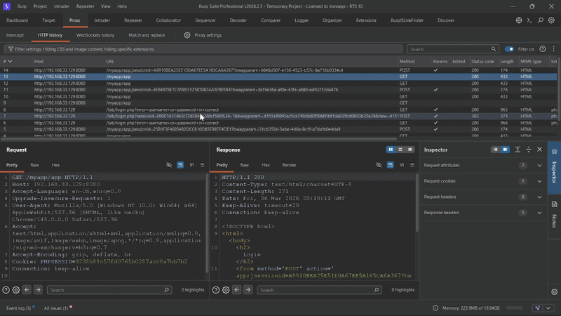
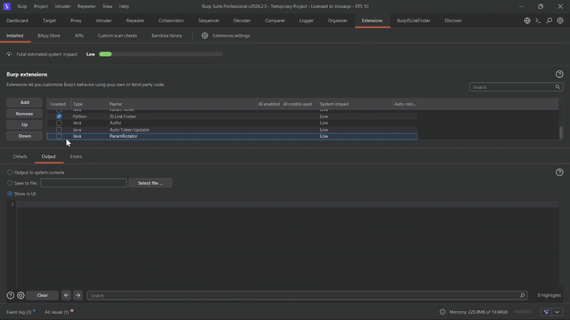
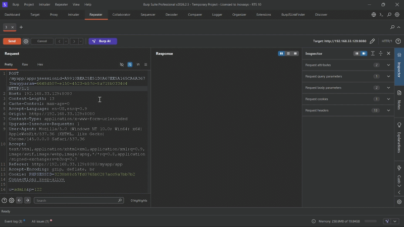
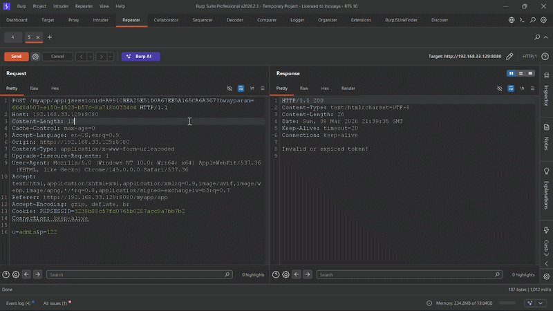

# ParamRotator – Dynamic Parameter Auto-Refresher

[](https://portswigger.net/burp)
[](https://www.oracle.com/java/technologies/javase/jdk21-archive-downloads.html)
[](https://maven.apache.org/)
[](LICENSE)
[]()

> A Burp Suite extension that automates dynamic HTTP parameter management for penetration testing of Internet Banking and enterprise web applications.

---

## Overview

**ParamRotator – Dynamic Parameter Auto-Refresher** is a Burp Suite extension for tracking and maintaining dynamic HTTP parameters during manual security testing.

It extracts selected parameters from requests and responses, keeps their latest values, and automatically applies them to outgoing Burp Repeater requests.

ParamRotator supports query parameters, matrix path parameters, Location headers, response-based updates, and periodic refresh through a reference request.

---

## Table of Contents

- [Overview](#Overview)
- [The Problem](#the-problem)
- [The Solution](#the-solution)
- [Features](#features)
- [Architecture](#architecture)
- [Refresh Modes](#refresh-modes)
- [Requirements](#requirements)
- [Installation](#installation)
- [Usage](#usage)
- [Demo](#demo)
- [Contributing](#contributing)
- [License](#license)

---

## The Problem

Modern web applications rely heavily on **dynamic parameters** that rotate frequently during a user session — session identifiers, application-specific security parameters, and more.

When performing security testing in **Burp Suite**, these values expire quickly. Previously captured requests become invalid and must be manually updated before they can be replayed.

This creates real friction for pentesters:

- Requests fail in **Repeater** due to expired tokens
- Testing workflows are constantly interrupted by stale parameters
- Multiple dynamic values must stay synchronized across requests
- Time is spent on maintenance instead of vulnerability discovery

Handling these parameters manually slows testing down and introduces errors — outdated values, missed parameters, and unreproducible findings.


---

## The Solution

ParamRotator automates the full token lifecycle:
```
Extract → Store → Refresh → Inject
```

Two refresh modes are available depending on the application's session binding behavior — see [Refresh Modes](#refresh-modes).

---

## Features

### Parameter Extraction
- Extract **matrix parameters** (`;param=value`) from URL path
- Extract **URL query parameters** (`?param=value`)
- Extract parameters from **Location headers**
- Add **custom parameters** manually

### Automatic Parameter Injection
- Injects the latest tracked parameter values into outgoing Repeater requests
- Extracts updated parameter values from Repeater responses
- Eliminates repetitive manual copying and replacement

### Auto-Refresh
- Background thread sends a reference request at a configurable interval
- Automatically updates stored parameters from the response
- Configurable refresh interval in seconds

### Two Refresh Modes
- Repeater Listener Mode — updates tracked parameters from Repeater responses
- Reference Request Mode — periodically sends a saved request to obtain fresh parameter values

### Parameter Manager UI
- Visual table showing all tracked parameters with current values
- Enable / disable parameters individually
- Toggle auto-update per parameter
- Add, edit, delete parameters

### Burp Integration
- Works directly inside Repeater
- Right-click context menu integration
- Custom **ParamRotator tab** inside Repeater showing the updated request
- Clean extension unload with no resource leaks

### Debugging Mode
- Toggle detailed logging for parameter updates and refresh cycles

---

## Architecture
```
src/main/java/
├── Main.java
│
├── core/
│   ├── ParameterManager.java     ← extract, store, inject parameters
│   ├── AutoRefreshService.java   ← background thread, HTTP refresh
│   ├── DebuggingMode.java        ← toggle verbose logging
│   ├── Settings.java             ← refresh mode management
│   └── Parameter.java            ← data model
│
├── handler/
│   └── RepeaterHttpHandler.java  ← auto-inject + auto-extract on every Repeater send
│
└── gui/
    ├── UIController.java              ← context menu, user actions
    ├── ParameterDialog.java           ← parameter manager popup
    ├── ParameterTableModel.java       ← Swing table data model
    └── ParamRotatorRequestEditor.java ← custom tab in Repeater
```

---

## Refresh Modes

### Repeater Listener Mode *(default)*

The extension listens to every Repeater request and response:
```
User presses Send
    → inject current parameter values into the request 
    → request is sent to the server
    → extract updated parameter values from the response 
    → ready for the next Send with fresh tokens 
```

Best for applications **with endpoint binding** — tokens are valid across endpoints.

### Reference Request Mode

The extension sends a saved reference request at a fixed interval:
```
Set as Reference → Start Auto-Refresh
    → background thread sends reference request every N seconds
    → extracts fresh tokens from the response
    → injects them into the Repeater request
```

Best for applications **without endpoint binding** — tokens are tied to specific endpoints.

Switch between modes via right-click → **Mode: Repeater Listener / Reference Request**.

---

## Requirements

| Dependency | Version |
|------------|---------|
| Java JDK   | 21      |
| Maven      | 3.6+    |
| Burp Suite | 2026+   |

---

## Installation

### Option 1 — Install from Release *(recommended)*

1. Download the latest `ParamRotator.jar` from the [Releases](https://github.com/0xx01/ParamRotator-Dynamic-Parameter-AutoRefresher/releases) page.
2. Open **Burp Suite**.
3. Navigate to **Extensions → Add**.
4. Set **Extension Type** to `Java`.
5. Select the downloaded `ParamRotator.jar`.
6. Click **Next**.

### Option 2 — Build from Source
```bash
git clone https://github.com/0xx01/ParamRotator-Dynamic-Parameter-AutoRefresher.git
cd ParamRotator-Dynamic-Parameter-AutoRefresher
mvn clean package
```

The compiled JAR will be at `target/ParamRotator.jar`. Load it into Burp Suite using the same steps above.

---

## Usage

### Repeater Listener Mode *(default)*

**Step 1 — Extract Parameters**

Right-click any request → **Extract Parameters from Request**



**Step 2 — Send to Repeater**

Intercept the target request → Send to Repeater → Drop

**Step 3 — Press Send**

Press Send in Repeater. ParamRotator will automatically inject and fresh parameter values on every request.

---

### Reference Request Mode

**Step 1 — Extract Parameters**

Right-click any request → **Extract Parameters from Request**


**Step 2 — Set as Reference**

Right-click the login or token-issuing request → **Set as Reference**


**Step 3 — Start Auto-Refresh**

Open target request in Repeater → right-click → **Start Auto-Refresh**



---

### Parameter Manager *(optional)*

Right-click → **Manage Parameters...** to open the Parameter Manager.



---

### Context Menu Reference

| Menu Item | Description |
|-----------|-------------|
| **Set as Reference** | Save the current request as the parameter source |
| **Remove Reference Request** | Clear the saved reference request |
| **Extract Parameters from Request** | Extract matrix and query params from URL |
| **Extract Parameters from Location Header** | Extract params from a redirect Location header |
| **Start Auto-Refresh** | Start background token refresh (Repeater only) |
| **Stop Auto-Refresh** | Stop the background refresh scheduler |
| **Set Interval** | Change the refresh interval (default: 30s) |
| **Manage Parameters...** | Open the Parameter Manager UI |
| **Debugging Mode** | Toggle verbose logging in Burp output |
| **Mode: ...** | Switch between Repeater Listener and Reference Request mode |

---

## Demo
**Demo Reference Request Mode**

[](https://youtu.be/QiWHnsslB0c)

**Demo Repeater Listener Mode**

[](https://youtu.be/fd5fb0pHxNw)

---

## Contributing

Contributions, issues, and feature requests are welcome.

If you'd like to contribute:

1. Fork the repository
2. Create a new branch (`feature/your-feature-name` or `fix/your-bug-name`)
3. Commit your changes
4. Push to your fork
5. Open a Pull Request

You can also open an Issue to discuss ideas or report bugs:
https://github.com/0xx01/ParamRotator-Dynamic-Parameter-AutoRefresher/issues

---

## License

This project is licensed under the **MIT License**. See the [LICENSE](https://github.com/0xx01/ParamRotator-Dynamic-Parameter-AutoRefresher/blob/main/LICENSE) file for full details.
